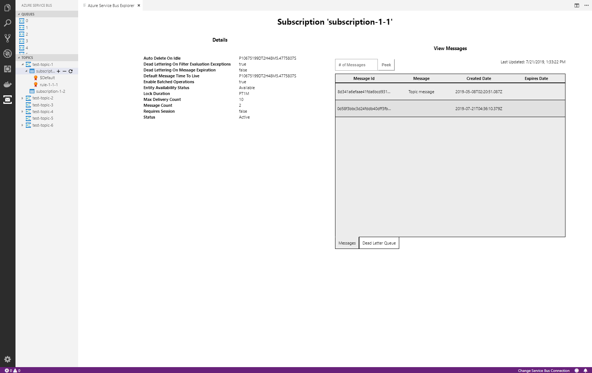

# Azure Service Bus Explorer VSCode Extension

## Features

* Create And Delete Queues, Topics, Subscriptions, and Rules
* View Messages in Queues and Subscriptions
* Send Messages with User Properties to Queues and Topics

## Requirements

This extension uses the following libraries to interact with the service bus:

* @azure/service-bus
* azure-sb

## Extension Settings

This extension contributes the following settings:

* `azureServiceBusExplorer.connectionString`: sets the service bus connection string
